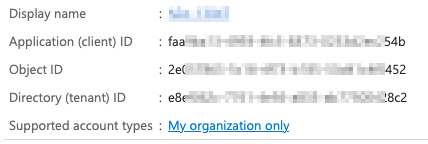
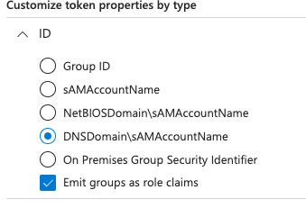

# Azure AD

Azure AD (or Microsoft Entra in the near future) is an OIDC-compliant identity provider from Azure.
It is available to all Azure subscriptions, even to the free one, although with some limitations.

## Register a new application

Sign in to the Azure Active Directory service in the Azure portal, and create a new registration following the "App registrations" link
(the redirect URL can be set later).

Each app will be associated to a name and a few IDs, as shown in the following image:



The "Certificates & secrets" section allows for client secrets creation, used for authenticating Pinniped to Azure.
As secrets require an expiration date, it is important to set up a process (either manual or automated) to rotate such secrets and prevent the app from becoming unusable.

## Token configuration

Token configuration is then required to include group memberships in the token itself, and thus be able to set up proper RBAC based on groups rather than users.
[Azure official docs](https://learn.microsoft.com/en-us/azure/active-directory/hybrid/connect/how-to-connect-fed-group-claims) explains how to properly add the groups claim, so does it list the limits in the number of groups that can be passed along into the token.

Such limits can be easily reached in an enterprise environment, that's why either group filtering or app roles adoption can be applied to cope with them.
Microsoft recommends to use App roles for new apps and when nested groups are not required.
Users and groups can be then assigned to such roles, which are eventually passed to the token, via the `roles` claim, and used for RBAC in the app.
Application roles are tipically fewer than the groups a user may be member of, and this guarantees that the token's constraints are honoured at all times.

It is also possible to still include groups into the token but emit them as roles, and make the application request the `roles` claim.



One thing to remember is that for AzureAD-only groups, the Group ID will be included in the token and not its name, regardless of the choice made in the previous image.
In fact, such groups have no concept of DNSDomain or sAMAccountName, and therefore the only unique property that can be used is the Group ID.

You also need to add some optional claims, at least the `preferred_username` claim, that is going to be used as the user's identifier.

You might also need to configure some API permissions, depending on your Azure AD setup.
Please refer to your Azure admin for guidance.

## Define variables

You can now define some variables that will be used for configuring Pinniped,
replacing the `AZURE_*` placeholders with the values specific to your app:

```sh
IDP_NAME="azure"
OIDC_ISSUER_URL="https://login.microsoftonline.com/AZURE_TENANT_ID/" # the trailing slash is mandatory
OIDC_CLIENT_ID="AZURE_CLIENT_ID"
OIDC_CLIENT_SECRET="AZURE_CLIENT_SECRET"
OIDC_GROUPS_CLAIM="groups"
OIDC_USERNAME_CLAIM="preferred_username"
OIDC_SCOPES="email,profile,openid"
```

!!! important
    - The `AZURE_CLIENT_SECRET` placeholder refers to the actual secret value, not the ID.
    - When using app roles or emitting groups as roles, the `OIDC_GROUPS_CLAIM` property in the above snippet must be set to `roles`.
