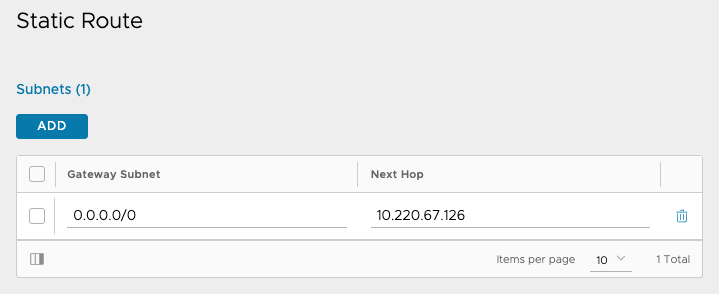

# NSX ALB Setup

## AVI Essentials

| Object Type            | Name                                                                             | License Violations                                                                                                                                        |
|------------------------|----------------------------------------------------------------------------------|-----------------------------------------------------------------------------------------------------------------------------------------------------------|
| ServiceEngineGroup     | Default-Group                                                                    | Field ServiceEngineGroup.ha_mode cannot have HA_MODE_SHARED as its value in ESSENTIALS license tier. Allowed value(s): HA_MODE_LEGACY_ACTIVE_STANDBY.     |
|                        |                                                                                  | Field ServiceEngineGroup.hm_on_standby cannot have True as its value in ESSENTIALS license tier. Allowed value: False.                                    |
|                        |                                                                                  | Field ServiceEngineGroup.app_cache_percent cannot have 10 as its value in ESSENTIALS license tier. Allowed value: 0.                                      |
|                        |                                                                                  |                                                                                                                                                           |
| IpamDnsProviderProfile | h2o-dns                                                                          | Field IpamDnsProviderProfile.internal_profile.dns_service_domain cannot be set in ESSENTIALS license tier.                                                |
|                        |                                                                                  | Field IpamDnsProviderProfile.type cannot have IPAMDNS_TYPE_INTERNAL_DNS as its value in ESSENTIALS license tier. Allowed value(s): IPAMDNS_TYPE_INTERNAL. |
|                        |                                                                                  |                                                                                                                                                           |
| SSLKeyAndCertificate   | root-ca                                                                          | Field SSLKeyAndCertificate.ocsp_config cannot be set in ESSENTIALS license tier.                                                                          |
|                        |                                                                                  |                                                                                                                                                           |
| SSLKeyAndCertificate   | int-ca                                                                           | Field SSLKeyAndCertificate.ocsp_config cannot be set in ESSENTIALS license tier.                                                                          |
|                        |                                                                                  |                                                                                                                                                           |
| SSLKeyAndCertificate   | avi2215                                                                          | Field SSLKeyAndCertificate.ocsp_config cannot be set in ESSENTIALS license tier.                                                                          |
|                        |                                                                                  |                                                                                                                                                           |
| Cloud                  | Default-Cloud                                                                    | Field Cloud.vcenter_configuration.content_lib cannot be set in ESSENTIALS license tier.                                                                   |
|                        |                                                                                  | Field Cloud.dns_provider_uuid cannot be set in ESSENTIALS license tier.                                                                                   |
|                        |                                                                                  |                                                                                                                                                           |
| Pool                   | domain-c8--vmware-system-csi-vsphere-csi-controller-vsphere-csi-controller--2113 | Field Pool.append_port cannot have NON_DEFAULT_80_443 as its value in ESSENTIALS license tier. Allowed value(s): NEVER.                                   |
|                        |                                                                                  | Field Pool.connection_ramp_duration cannot have 10 as its value in ESSENTIALS license tier. Allowed value: 0.                                             |
|                        |                                                                                  |                                                                                                                                                           |
| Pool                   | domain-c8--kube-system-kube-apiserver-lb-svc-kube-apiserver-lb-svc--443          | Field Pool.append_port cannot have NON_DEFAULT_80_443 as its value in ESSENTIALS license tier. Allowed value(s): NEVER.                                   |
|                        |                                                                                  | Field Pool.connection_ramp_duration cannot have 10 as its value in ESSENTIALS license tier. Allowed value: 0.                                             |
|                        |                                                                                  |                                                                                                                                                           |
| Pool                   | domain-c8--kube-system-kube-apiserver-lb-svc-kube-apiserver-lb-svc--6443         | Field Pool.append_port cannot have NON_DEFAULT_80_443 as its value in ESSENTIALS license tier. Allowed value(s): NEVER.                                   |
|                        |                                                                                  | Field Pool.connection_ramp_duration cannot have 10 as its value in ESSENTIALS license tier. Allowed value: 0.                                             |
|                        |                                                                                  |                                                                                                                                                           |
| Pool                   | domain-c8--vmware-system-csi-vsphere-csi-controller-vsphere-csi-controller--2112 | Field Pool.append_port cannot have NON_DEFAULT_80_443 as its value in ESSENTIALS license tier. Allowed value(s): NEVER.                                   |
|                        |                                                                                  | Field Pool.connection_ramp_duration cannot have 10 as its value in ESSENTIALS license tier. Allowed value: 0.                                             |
|                        |                                                                                  |                                                                                                                                                           |
| VirtualService         | domain-c8--vmware-system-csi-vsphere-csi-controller                              | Field VirtualService.enable_autogw cannot have True as its value in ESSENTIALS license tier. Allowed value: False.                                        |
|                        |                                                                                  |                                                                                                                                                           |
| VirtualService         | domain-c8--kube-system-kube-apiserver-lb-svc                                     | Field VirtualService.enable_autogw cannot have True as its value in ESSENTIALS license tier. Allowed value: False.                                        |
|                        |                                                                                  |                                                                                                                                                           |

Set the route to the default gateway for all the non-management networks used by VIPs and Service Engines in the `global` VRFContext:

