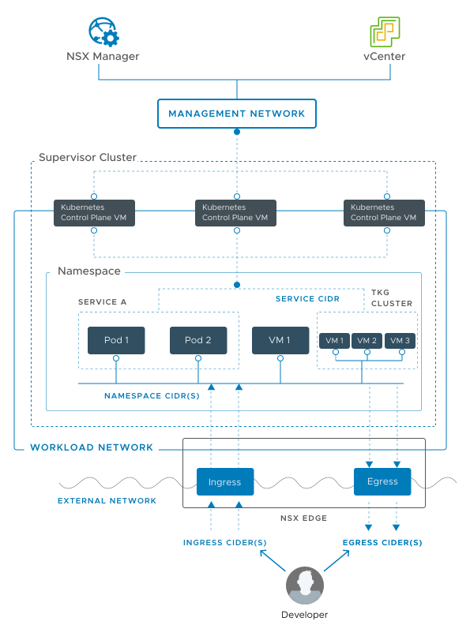
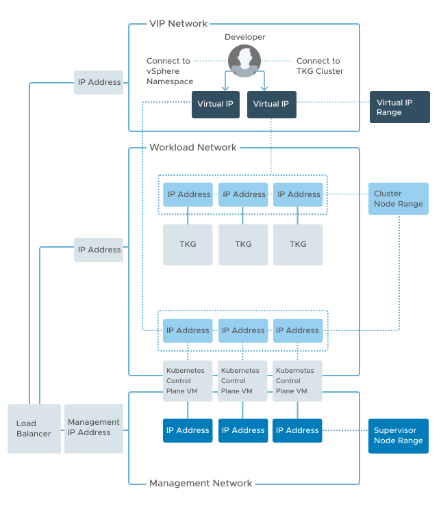

# Prerequisites

1. identify 5 consecutive IPs for Supervisor VMs (1 floating VIP, 3 VMs IPs, 1 free IP to allow nodes rollouts)
1. identify IP ranges in every network (used for either management or workload) for AVI Service Engines and VIPs (they can optionally use separate ranges). Provide at least 2 IPs for SEs and as many IPs as needed for VIPs.
1. identify IP ranges in every workload network
1. set up L4 load balancer
1. set up the firewall to allow the required network flows

## Networking overview

vSphere with Tanzu Workload Management can be enabled using either VDS or NSX-T as networking layer.

### NSX networking

### VDS networking

## Create subscribed content library

<https://docs.vmware.com/en/VMware-vSphere/7.0/vmware-vsphere-with-tanzu/GUID-6519328C-E4B7-46DE-BE2D-FC9CA0994C39.html>

Subscription URL: `https://wp-content.vmware.com/v2/latest/lib.json`

## Create local content library (for air-gapped environments)

<https://docs.vmware.com/en/VMware-vSphere/7.0/vmware-vsphere-with-tanzu/GUID-E8C37D8A-E261-44F0-9947-45ABAB526CF3.html>
