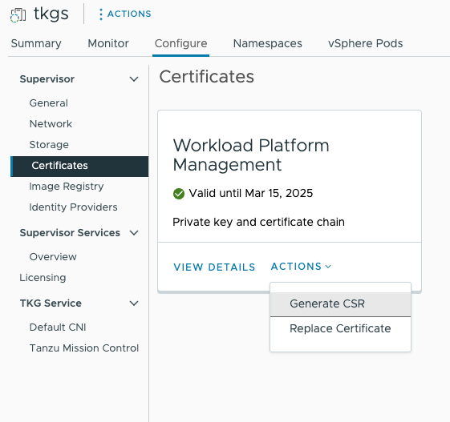

# Supervisor cluster

## Prerequisites

1. identify 5 consecutive IPs for Supervisor VMs (1 floating VIP, 3 VMs IPs, 1 free IP to allow nodes rollouts)
1. identify IP ranges in every network (used for either management or workload) for AVI Service Engines and VIPs (they can optionally use separate ranges). Provide at least 2 IPs for SEs and as many IPs as needed for VIPs.
1. identify IP ranges in every workload network
1. set up L4 load balancer, either HAProxy or [NSX ALB](./nsxalb.md) are supported
1. set up the firewall to allow the required network flows

## Create the cluster

By default, enabling a supervisor cluster creates a content library named "Kubernetes Service Content Library",
that subscribes to <https://wp-content.vmware.com/v2/latest/lib.json>.

## Replace certificates

You can replace original certificates with one issued by your own authority.
You can follow the [official documentation](https://docs.vmware.com/en/VMware-vSphere/8.0/vsphere-with-tanzu-installation-configuration/GUID-CF707AE9-7BD7-47BC-AAD7-BCF17DCB640D.html),
so you can generate the CSR and sign it.



When uploading the newly generated certificate, do remember to append to it all the signing CA certificates *in order*:

1. server
1. intermediate CA
1. root CA

## Connect

```sh
kubectl vsphere 
```
